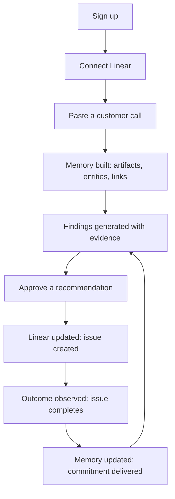
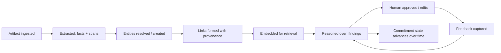
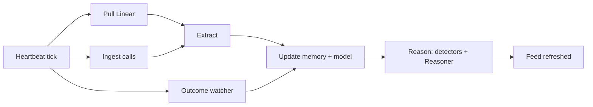
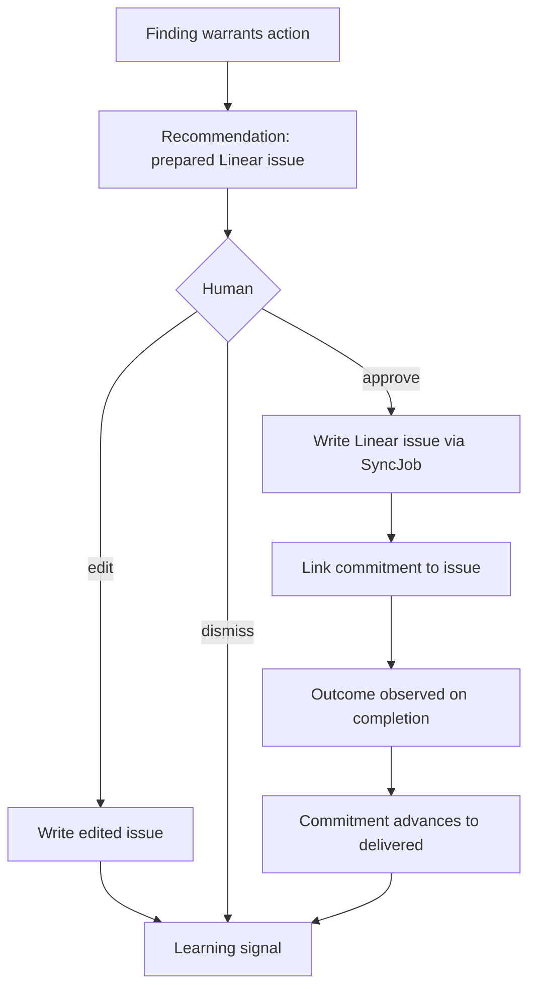
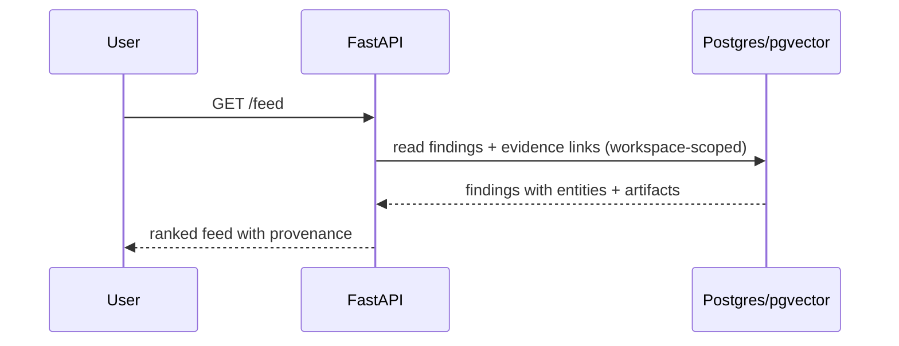
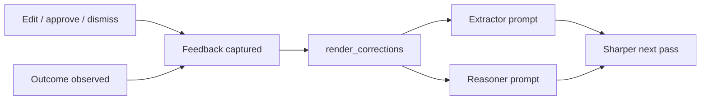

# Orbit
## what is orbit ?
Orbit is an execution platform with its own native meeting platform. Teams can run customer meetings in Orbit or automatically import conversations from the meeting platforms they already use. After every conversation, Orbit prepares proposed updates across the company—from CRM records and product plans to engineering work, timelines, and customer follow-ups. Every change is reviewed by humans before Orbit synchronizes approved updates into the tools the team already uses.


# Orbit MVP — System Design Document

**Status:** Official engineering blueprint · **Version:** 1.0 · **Date:** 2026-07-12
**Supersedes:** `docs/backend-architecture.md` (which documents the pre-MVP-redesign codebase).

This is the reference architecture for the Orbit MVP. It consolidates the agreed
design. It introduces no new features and expands no scope. Every subsystem below
is either reused from the current codebase, a generalization of something that
already exists, or one of three new pieces of substrate (Artifact, Entity, Link).

**The loop this product exists to run:**

> Observe → Remember → Understand → Reason → Recommend → Approve → Execute → Learn

Throughout this document, features are tagged with the loop capability they serve:
`[Observe] [Remember] [Understand] [Reason] [Recommend] [Approve] [Execute] [Learn]`.
Any component that supports none of these does not belong in the MVP.

---

## 1. Executive Summary

**Product vision.** Orbit is the AI Operating System for companies: a layer that
sits above the tools a company already uses, continuously maintains a memory and a
small model of the company, reasons across it, and surfaces where intent and
reality have diverged, with a prepared fix a human approves. It makes a company
legible to AI by default.

**Problem solved.** A company's knowledge is fragmented across tools, so no layer
holds a unified model of what was promised, decided, and is actually being built.
The company runs in an open loop: decisions are made, work drifts, and someone
notices weeks later from a lagging signal. Existing tools each model one slice and
silently assume a human is the integration layer and the control loop.

**MVP scope.** Two data sources (Linear and customer calls), one memory substrate,
a thin company model, deterministic detectors plus one reasoning agent, a
proactive feed of evidence-backed findings, a human-approved write back to Linear,
and free learning from edits and outcomes. This runs the entire loop end to end on
a real slice of a real company.

**Why Orbit exists.** To close the loop between what a company says it is doing and
what it is actually doing, continuously and with evidence, so a small team can stay
aligned without meetings, status chasing, or manual glue work.

**What makes Orbit different.** It is not a place you go to do work and it is not a
report you read. It is a model plus a loop. It consumes the systems of record as
sensors, reasons across them as one whole, and proposes corrections a human
approves. Its value compounds: the longer it runs, the more precisely it models
this specific company.

---

## 2. Product Philosophy

Orbit is defined as much by what it is not as by what it is.

- **Orbit is not a project management tool.** It never asks a human to maintain its
  model by entering tasks or status. Linear remains the system of record for work.
- **Orbit is not a CRM.** Customers are entities in the company model, not records a
  human curates. It reads customer context; it does not become the place you manage
  accounts.
- **Orbit is not a dashboard.** It does not present metrics for a human to interpret.
  It reasons and recommends. If a surface becomes a wall of charts, it has drifted.
- **Orbit is not a meeting assistant.** Calls are one sensor among the company's
  inputs, not the product. Orbit models the company, not the meeting.
- **Orbit is not a chatbot.** There is no stateless prompt box. Intelligence is
  delivered proactively; a query surface, if it ever ships, is a thin view onto the
  model, never the product.

**Guiding principles.**

1. Model the company, not the tool.
2. Derive the model from real activity. Data entry is a smell.
3. Close the loop. Every finding has a path to action; every action has an observed outcome.
4. Evidence or it did not happen. No claim without traceable provenance.
5. Propose, do not impose. Humans hold authority over consequential action.
6. Be a substrate, not a destination. Consume systems of record and write back to them.
7. Reuse before rewriting. Prefer generalizing existing code to building new.

---

## 3. MVP Scope

### Included

| Capability | What ships |
|---|---|
| `[Observe]` | Continuous ingestion of Linear activity and customer calls (paste, optional Zoom/Meet OAuth). |
| `[Remember]` | Unified company memory (Artifacts) with provenance and time. |
| `[Understand]` | Thin company model: entities (customer, commitment, feature/request, goal) and the links that connect a call to a commitment to a Linear issue. |
| `[Reason]` | Deterministic detectors (commitment-vs-Linear, repeated demand, drift, aging/stalled) plus a Reasoner agent that narrates and ranks. Runs continuously. |
| `[Recommend]` | Evidence-backed findings, some carrying a prepared Linear action, in a proactive feed. |
| `[Approve]` | Human approve / edit / dismiss on every recommendation. |
| `[Execute]` | Approved recommendation writes a real Linear issue. |
| `[Learn]` | Edits, approvals, dismissals, and outcomes captured and injected into agent prompts. |

### Intentionally excluded (postponed, not cancelled)

| Excluded | Reason |
|---|---|
| GitHub, Slack, Notion, CRM, email ingestion | Two sources prove the concept. GitHub is the first post-MVP sensor. |
| Additional write destinations (Jira, Notion, CRM, email) | Linear-only proves the closed loop. |
| Open-ended natural-language chat / Ask | The proactive feed is the aha. Chat invites coverage disappointment. |
| General knowledge graph + graph UI | The MVP needs a few typed links, not a graph engine. |
| Metric dashboards, kanban boards, calendar grid, CRM pages | Category violations. |
| Outcome-weighted ranking, per-entity preference learning | Compounds over months; capture signal now, build later. |
| Multi-agent execution ecosystem | Post-PMF. |

---

## 4. User Journey



The critical path to the first aha is deliberately two inputs on one screen
(connect Linear, paste one call). Within minutes Orbit shows a true, cross-source
observation the user never typed in, and one click turns it into a real Linear
issue. Everything after is "leave it running."

---

## 5. Frontend Architecture

**Stack:** React (Next.js App Router), reusing the existing component library and
the premium light theme. **Four pages**, one persistent action, one status
indicator. No more.

### Navigation

```
┌─────────────────────────────────────────────────────────────┐
│  ◎ Orbit        Feed    Memory    Settings      [+ Add call]  ●│
└─────────────────────────────────────────────────────────────┘
```

`●` shows heartbeat/sync status ("last observed 4m ago"). `[+ Add call]` is a
global paste action available everywhere.

### Page 1 — Onboarding / Connect · `[Observe]`

- **Purpose.** Reach the aha in one screen with two inputs and no configuration.
- **Components.** Linear API-key connect (reused), source toggle (paste / Zoom-Meet), transcript paste box, primary CTA.
- **User flow.** Signup lands here → connect Linear → paste one call → "Build my company memory" → live progress → Feed.
- **States.** Empty: two fields. Loading/AI: an honest progress line ("Reading your calls and Linear... found 3 customers, 12 commitments, 48 issues"). Error: inline, per field.
- **Extension points.** Additional sensors appear here later as connect cards.

### Page 2 — Feed (home) · `[Reason] [Recommend] [Approve]`

- **Purpose.** The product's core surface: a ranked stream of evidence-backed findings, some carrying a prepared action.
- **Components.** Finding card (kind chip, title, one-line evidence, Review), detail drawer (reasoning, evidence links to artifacts, prepared Linear action, Approve / Edit / Dismiss), kind filter.
- **User flow.** Scan → open a finding → read evidence → approve / edit / dismiss.
- **States.** Empty pre-scan: "Orbit is reading your company." Empty post-clean-scan: "Nothing has drifted. Orbit is watching." Loading: skeleton cards. AI: a regenerating finding shows a subtle reasoning shimmer; every finding always shows provenance.
- **Extension points.** New finding kinds and new action types (beyond create-Linear-issue) slot into the same card/drawer.

```
 Feed                                     ⟳ auto-updating · last scan 4m ago
 ─────────────────────────────────────────────────────────────
 ▲ DRIFT  SSO committed to Acme, no Linear issue exists
   Evidence: Acme call (Tue) · 0 matching issues        [Review →]
 ─────────────────────────────────────────────────────────────
 ◆ TREND  4 customers keep asking for audit logs
   Acme, Northwind, Vela, Orbit · this month            [Review →]
 ─────────────────────────────────────────────────────────────
   drawer: reasoning + evidence spans + prepared action
   [ Approve & create ]  [ Edit ]  [ Dismiss ]
```

### Page 3 — Memory · `[Remember] [Understand]`

- **Purpose.** Prove the company is legible. Browse observed memory entity-first, with provenance.
- **Components.** Entity list with search; entity detail (commitments, requests, connected Linear work, timeline, source artifacts); artifact detail (raw call/issue plus what Orbit extracted, with each fact linked to its source span).
- **User flow.** Pick an entity → see everything connected across sources on a timeline → drill to the artifact and the exact span behind any fact.
- **States.** Empty: "Orbit hasn't observed anything here yet." AI: every extracted fact links back to its source span (auditable).
- **Extension points.** As new sensors are added, more artifact kinds and links appear on the same entity pages. Entity/artifact detail are views inside this page, keeping the page count at four.

### Page 4 — Settings / Connections · `[Observe]`

- **Purpose.** Manage connections and the workspace, honestly labeling live vs roadmap.
- **Components.** Linear connection (live), call sources (paste history, Zoom/Meet OAuth), "on the roadmap" list, workspace basics, theme toggle. Reuses the existing integrations page, stripped to what is real.
- **Extension points.** Future connectors register here.

**Deliberately not built:** chat/Ask page, metric dashboard, task boards, calendar grid, CRM record pages.

---

## 6. Backend Architecture

**Stack:** FastAPI monolith, async SQLAlchemy, PostgreSQL + pgvector, Alembic.
**Opinionated change:** the LangGraph orchestration is removed from the MVP path
(its only value was the parallel team fan-out that is being cut); the two agents
are called directly.

| Service | Disposition | Responsibility |
|---|---|---|
| Context Engine (`context/engine.py`) | **Reuse** | Assemble one capped, hybrid-retrieved context package for the agents; re-pointed at Artifact + Entity. |
| Embeddings (`services/embeddings.py`) | **Reuse** | Vectorize artifacts/entities for semantic retrieval. |
| Ingestion (generalize Zoom/Meet/Calendar/Linear pulls) | **Generalize** | One sensor service: pull new source activity, ingest calls. |
| Extraction (generalize `meeting-intelligence`) | **Generalize** | The Extractor agent; structures every artifact. |
| Reasoning (`services/insights.py` detectors + comparator + `intelligence-brief`) | **Reuse/Generalize** | Detectors + the Reasoner agent produce findings and the brief. |
| Entity resolution (generalize `services/customers.py`) | **Generalize** | Resolve and dedupe entities across sources. |
| Sync (`services/sync.py`) + Linear (`services/linear.py`) | **Reuse/Simplify** | One approved recommendation → one Linear issue. |
| Outcome watcher (generalize Linear loop-closure) | **Reuse** | Detect issue completion; close the commitment. |
| Learning (`services/learning.py`, Feedback) | **Reuse** | Capture corrections/outcomes; inject into prompts. |
| Heartbeat (`services/heartbeat.py`) | **Reuse/Generalize** | Scheduler that pulls sensors and runs reasoning. |
| LangGraph orchestrator, execution-planner, crm/eng/design/qa/sales agents, knowledge service | **Remove** | Belongs to the retired proposal pipeline. |

**Interactions.** Ingestion writes Artifacts and triggers Extraction, which updates
memory (Artifacts) and the model (Entities, Links) through entity resolution. The
Heartbeat periodically runs detectors and the Reasoner over the model, upserting
findings, and runs the outcome watcher. The Approval flow turns an approved
recommendation into a Sync job that writes to Linear and records the outcome and
learning signal. Authentication and workspace tenancy (Clerk JWT, `workspace_id`)
are reused unchanged and scope every operation.

---

## 7. AI Architecture

**Two agents. Everything else deterministic.** This is the minimum that runs the loop.

### Extractor (per artifact) · `[Understand]`
- **Input.** One artifact (call transcript or Linear issue) plus a narrow context slice for entity linking.
- **Output (typed, constrained decoding).** Summary, commitments, requests, decisions, status, and mentioned entities, each with the source span it came from.
- **Prompt flow.** A single professional-persona prompt with the shared context preamble and recent learned corrections appended.

### Reasoner (workspace-wide) · `[Reason] [Recommend]`
- **Input.** Deterministic detector outputs plus a model-shaped context package from `render_context` (goals, commitments, open work, recent artifacts).
- **Output.** Evidence-linked findings, the weekly brief, and recommendation text with a proposed Linear action.
- **Prompt flow.** Detectors run first and cheaply produce candidate findings with hard evidence; the Reasoner ranks, narrates, deduplicates by entity, and drafts actions. The LLM explains and proposes; it does not decide what is true.

### Deterministic reasoning (no LLM) · `[Reason]`
Entity resolution, the detectors (commitment-vs-Linear, repeated demand, drift, aging/stalled), the `_similar` comparator, embeddings, and the outcome watcher. This is the reliable backbone.

### Context retrieval
The Context Engine performs hybrid retrieval (indexed SQL for facts, pgvector
semantic recall for meaning, keyword fallback when AI is off), capped per source,
and renders one compact context block consumed identically by both agents.

### Recommendation generation · `[Recommend]`
A recommendation is a finding whose action is a fully-formed Linear issue (team,
title, description grounded in the evidence). It is never executed without approval.

### Learning · `[Learn]`
Edits, approvals, dismissals, and outcomes are captured as Feedback.
`render_corrections` injects recent corrections into both agent prompts. Dismissed
finding types are down-weighted. No third agent.

### Provider strategy
Provider-agnostic model service: a free model in development, Anthropic in
production, switchable by environment only. Every agent call falls back to a
deterministic, transcript-derived version on failure or when AI is disabled, so the
product runs with no LLM at all.

**Why only two agents.** Extraction is per-artifact; reasoning is workspace-wide.
Separating them keeps caching and cost clean. Everything else that looks like
"AI" (matching, resolution, detection) is deterministic and therefore reliable,
cheap, and explainable. Fewer agents means fewer failure modes and a smaller
surface to get right.

---

## 8. Memory Architecture

Memory has two tiers and a temporal spine.

- **Observed tier — Artifacts.** `[Remember]` Everything ingested from any source, each with raw content, the Extractor's structured output, an embedding, an `occurred_at`, and provenance. Broad and automatic.
- **Derived tier — the company model.** `[Understand]` Computed from artifacts:
  - **Entities:** customers, commitments, features/requests, goals (and lightly, people), resolved across sources.
  - **Commitments** are first-class entities (what was promised, to whom, by when), linked to the artifact where promised and to the fulfilling Linear issue (or flagged unfulfilled).
  - **Goals** are declared intent, the reference signal reasoning compares against.
  - **Findings and recommendations** are derived intelligence, each linked to the entities and artifacts that justify it.
- **Links.** Typed, provenance-backed relationships (commitment→customer, commitment→issue, request→customer, artifact→mentions-entity), each carrying its source artifact and time.
- **Provenance.** Every extracted fact, link, and finding references the artifact and span it came from. Nothing is trusted that cannot be traced.
- **Embeddings and retrieval.** The Context Engine's hybrid retrieval reads across artifacts and entities to build agent context.
- **Temporal history.** Artifacts carry when things happened; commitments and entities carry state transitions (promised → tracked → delivered). Drift and causality live here.

### Memory lifecycle



Memory starts as a generic shell and converges, as calls and Linear flow in and
humans correct it, toward a precise model of what this company knows, intends, and
is actually doing. That convergence is the moat.

*(KnowledgeItem is retired; its job of storing approved truth is served by entity
state and captured Feedback.)*

---

## 9. Database Design

Conceptual only. Ownership is always a `Workspace`.

### Keep unchanged
| Model | Purpose |
|---|---|
| `Workspace` | Tenant boundary; owns all rows. |
| `Goal` | Declared company intent; the reference signal. |
| `Feedback` | Captured human corrections and outcomes; the learning signal. |
| `Integration` | Connector configuration and credentials (never exposed). |
| `CalendarConnection` | OAuth tokens for call sources. |
| `Approval` | Audit record of who approved which recommendation, when. |
| `SyncJob` | A prepared/executed outbound action (Linear issue create). |

### Remove
`ExecutionPlan` (projects), `Task`, `TimelineEvent`, `KnowledgeItem`, dashboard
rollups, `Member`/`Agent` display tables. These belong to the retired proposal
pipeline and the cut dashboard/CRM surfaces.

### Modify
| Model | Change |
|---|---|
| `Insight` → **Finding/Recommendation** | Add references to the entities and artifacts that justify it, a kind, an optional prepared-action payload, and lifecycle state (open, approved, dismissed, resolved). Fixes title-only dedup; lets a recommendation carry its action. |

### Add
| Model | Purpose | Lifecycle |
|---|---|---|
| `Artifact` | Unified observed memory (absorbs `Meeting`): source, kind, external ref, title, content, extracted, embedding, occurred_at, provenance. | Created on ingest; enriched on extraction; embedded; never edited by humans. |
| `Entity` | Company-model node (absorbs `Customer`): kind, name, aliases, identifiers, meta, state. | Created/resolved on extraction; state advances over time (e.g. commitment promised → delivered). |
| `Link` | Typed, provenance-backed reference between entities and artifacts. Start with only the types the drift finding needs. | Created on extraction/resolution; carries source artifact and time. |

### Relationships

```
Workspace 1─* Artifact
Workspace 1─* Entity  (customer | commitment | feature | goal | person)
Artifact  *─* Entity   via Link (mentions / source-of)
Entity    *─* Entity   via Link (requested_by / fulfills / owns / relates_to)
Entity(commitment) ── SyncJob ── external Linear issue (ref on the Link)
Insight (finding/rec) *─* Entity  and  *─* Artifact   (evidence)
Approval, Feedback ── reference the Insight they acted on
Goal ── referenced by reasoning; compared against Entity/commitment state
```

Net: three new tables, one repurposed, several removed. The schema shrinks in table
count while gaining the memory-plus-model core.

---

## 10. APIs

Most already exist; the new ones are thin.

| Endpoint | Purpose | Input | Output | Consumers |
|---|---|---|---|---|
| `POST /connect/linear` | Connect Linear (validate key live) | API key | Connection status | Onboarding, Settings |
| `GET/DELETE /integrations` | List / disconnect connections | — | Connections | Settings |
| `POST /artifacts` | Ingest a pasted call | Transcript, title, optional customer | Artifact id, status | Onboarding, Add call |
| `POST /sync/linear/pull` | Manual Linear pull (heartbeat does it automatically) | — | Count ingested | Settings |
| `GET /artifacts/{id}` | Observed item + extraction with spans | Artifact id | Artifact + extracted facts | Memory |
| `GET /entities` | List entities | Filter by kind | Entities | Memory |
| `GET /entities/{id}` | Entity detail: connected artifacts, links, timeline | Entity id | Entity graphlet | Memory |
| `GET /feed` | Ranked findings + recommendations with evidence | Filter by kind/status | Findings | Feed |
| `POST /findings/{id}/approve` | Approve a recommendation, write to Linear | Optional edits | Created issue ref | Feed |
| `POST /findings/{id}/edit` | Edit a recommendation (learning signal) | Edited fields | Updated finding | Feed |
| `POST /findings/{id}/dismiss` | Dismiss a finding (learning signal) | Reason (optional) | Ack | Feed |
| `GET /status` | Heartbeat / sync state | — | Last scan, counts | Nav status |

All endpoints are workspace-scoped via the existing auth. Retired: `/projects/*`
proposal endpoints, heavy `/meetings/*` analysis endpoints (folded into
`/artifacts`), timeline/activity endpoints.

---

## 11. Background Jobs

The **heartbeat** is the single scheduler, lifespan-managed, per workspace, on a
configurable interval. It only reads and writes memory and findings; it never
executes an outbound action or approves anything.

Per tick, per workspace:

1. **Ingestion** `[Observe]` Pull new Linear activity; ingest any new calls into Artifacts.
2. **Extraction** `[Understand]` Run the Extractor on new artifacts; resolve entities; form links.
3. **Reasoning** `[Reason]` Run detectors + the Reasoner over the model; upsert findings, deduped by entity.
4. **Outcome observation** `[Learn]` Reconcile approved actions against Linear reality; when a fulfilling issue completes, advance the commitment to delivered and emit a win finding.

**Scheduling notes.** Ingesting a pasted call runs the ingest → extract → reason
path immediately (not only on tick) so onboarding is instant. The interval and the
brief staleness threshold are environment-configured. The heartbeat uses its own
database session, never a request session.

---

## 12. System Flow

### Continuous processing flow



### Recommendation and execution flow



### Request flow (Feed load)



### Learning flow



---

## 13. Engineering Roadmap

Each milestone ships a usable, testable product. M1, M4, and M5 mostly generalize
existing code; M3 is the milestone to put in front of design partners.

### M1 — Company Memory `[Observe] [Remember]`
- **Goals.** Continuous, provenance-backed memory from Linear and calls.
- **Deliverables.** Connect screen; basic Memory list; `Artifact` store; generalized ingestion; Linear read sensor; heartbeat pulls; Extractor running on both sources.
- **Dependencies.** Existing Context Engine, embeddings, Linear read, heartbeat.
- **Acceptance.** Calls and Linear are remembered continuously with zero data entry; every fact traces to source and time.

### M2 — Company Model (thin) `[Understand]`
- **Goals.** Resolve entities and form the links that power findings.
- **Deliverables.** `Entity`, `Link`; generalized resolution; entity list + detail (commitments, requests, connected Linear work, timeline).
- **Dependencies.** M1.
- **Acceptance.** A commitment made on a call resolves to the right customer and links to its Linear issue, or is flagged untracked.

### M3 — Reasoning + the aha `[Reason] [Recommend]`
- **Goals.** Proactive, evidence-linked findings, continuously.
- **Deliverables.** Feed with cards, drawer, evidence, states; detectors re-pointed at the model; Reasoner; extend `Insight`; `GET /feed`.
- **Dependencies.** M2.
- **Acceptance.** The cross-source drift finding appears reliably with correct evidence; findings dedup by entity. **Validatable product.**

### M4 — Closed Loop `[Approve] [Execute]`
- **Goals.** Turn a finding into an approved Linear issue and observe the outcome.
- **Deliverables.** Prepared action in drawer; approve/edit/dismiss; recommendation → SyncJob → Linear write; outcome watcher closes commitments; `POST /findings/{id}/approve|edit|dismiss`.
- **Dependencies.** M3, existing SyncJob/Linear write.
- **Acceptance.** Approve a finding, a real Linear issue is created, its completion auto-closes the commitment.

### M5 — Learn (minimal) `[Learn]`
- **Goals.** The loop compounds.
- **Deliverables.** Generalized Feedback capture; corrections injected into both agents; dismissed types down-weighted; subtle "what Orbit learned."
- **Dependencies.** M4.
- **Acceptance.** An edit changes the next similar recommendation; a dismissed finding type surfaces less.

---

## 14. Design Decisions

| Decision | Why |
|---|---|
| **Only Linear** | It is both a real actuator (write) and a real execution-reality sensor (read), and it is already integrated. One connector proves the closed loop. |
| **Only customer calls** | Calls are where intent, commitments, and customer demand are born. Compared against Linear, they enable the killer cross-source finding. |
| **Two agents** | Extraction is per-artifact, reasoning is workspace-wide. Everything else is deterministic, which is more reliable, cheaper, and explainable. Fewer agents, fewer failure modes. |
| **No dashboard** | Dashboards leave sensing and deciding to the human, keeping the loop open. Orbit reasons and recommends instead. |
| **No chat** | A stateless prompt box has no proactivity and invites coverage disappointment. The proactive feed is the aha. |
| **Proactive feed** | The value is telling the user something true they did not ask for, with evidence, unprompted. |
| **Evidence-first reasoning** | Trust is the product. Every claim traces to a source span. Deterministic detectors produce hard evidence before the LLM narrates. |
| **Human approval** | Orbit proposes; humans decide. This makes autonomy adoptable and keeps a human in command. |
| **Deterministic detectors** | The reliable backbone of reasoning: cheap, explainable, and correct by construction. The LLM adds synthesis, not truth. |
| **Reuse existing architecture** | The Context Engine, embeddings, extraction, detectors, Linear I/O, approval, and learning already exist. The MVP re-points and strips them rather than rebuilding. |
| **Drop LangGraph from the MVP path** | Its only value was parallel team fan-out, which the MVP cuts. Direct agent calls are simpler. |

---

## 15. Future Roadmap (Post-MVP)

Documented for direction only. No implementation here and no change to the MVP.

- **GitHub sensor** as the next execution-reality source (commits, PRs) to sharpen drift detection.
- **Slack, Notion, CRM ingestion** to broaden company context.
- **Additional write connectors** (Jira, Notion, CRM, email) behind the same honest, human-approved seam.
- **Natural-language querying** as a thin view onto the model once coverage is deep enough to answer well.
- **Preference and outcome learning** (outcome-weighted ranking, per-entity style) once design partners are retained.
- **Additional sensors and the general company graph** as usage justifies them.

Each is additive to the existing loop and must obey the engineering principles below.

---

## 16. Engineering Principles

Rules that must never be broken. Any change that violates one is rejected.

1. **Every finding must carry evidence.** No claim without traceable provenance to a source artifact and span.
2. **Never replace systems of record.** Consume Linear (and future tools) as sensors and write back to them; never become the source of truth for work.
3. **Never require manual data entry.** The model is derived from real activity. Asking humans to maintain it is a category failure.
4. **Never ship unsupported AI claims.** Deterministic detectors establish truth; the LLM narrates and proposes. Fabrication is worse than silence.
5. **Keep humans in the approval loop.** No consequential outbound action without explicit human approval.
6. **Reuse before rewriting.** Prefer generalizing existing code to building new subsystems.
7. **Prefer simplicity.** The smallest design that runs the loop wins. Fewer agents, fewer tables, fewer pages.
8. **Keep the loop intact.** Every feature must strengthen at least one of Observe, Remember, Understand, Reason, Recommend, Approve, Execute, Learn. If it supports none, remove it.

**The single test for every future decision:** if a change does not make the memory
richer, the reasoning sharper, or the loop tighter on the Linear-plus-calls slice,
it does not ship. If it makes a human do more sensing, comparing, or deciding, it
is drifting toward a lesser category. Cut it.
```
